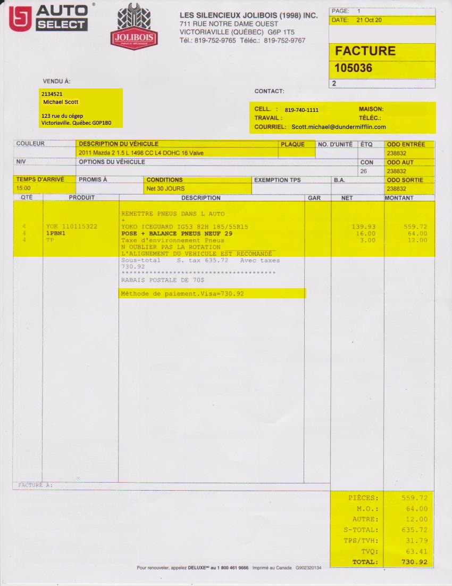

# Analyse - Révision A

## Mise en situation

À partir de l'image suivante, vous devez modéliser le système de facturation d'un garage de voiture.

{.center .shadow}

## Précisions

- Seulement les informations surlignées en jaunes doivent être sauvegardés (ou peuvent être reproduit exactement avec les autres informations sauvegardées).
- Le nombre 2134521 situé au-dessus du nom "Mathieu Fréchette" est le code de ce client.
- La description du véhicule est un champs texte associé au compte du client. Le client peut avoir plus d'un véhicule associé à son compte.
- La case PLAQUE est le numéro de la plaque d'immatriculation du véhicule
- Les trois champs ODO ... représente trois prise de l'odomètre du véhicule durant le travail facturé.
- Dans le détail de la facture : 
    - Le texte "Remettre Pneus dans l'auto" est un texte global à la facture que le commis a entré manuellement.
    - Il y a trois ligne de détail, chacune commençant par une quantité et un code de produit.
    - Le texte "N'oubliez pas la rotation... " est aussi un texte globale à la facture qu'un commis a entré manuellement.
    - On peu payer la facture selon plus d'un mode de paiement. Donc à la ligne "Méthode de paiement. Visa=730.92$" on pourrait retrouver plus d'un mode de paiement avec le montant pour chaque mode.
- Les "produits" sont classés en trois catégorie : Pièces, Main-d'œuvre (M.O.) et autre. Un produit ne peut avoir qu'une catégorie.
- Dans la table facturation, ajoutez deux colonnes, date_creation (type date) et user_creation (type varchar) qui seront remplies automatiquement avec un déclencheur.

## Schéma conceptuelle et diagramme de classe

Produisez schéma conceptuelle et un diagramme de classes à partir du système décrit plus haut.

Les deux diagrammes doivent respecter les normes de conception et la troisième forme normale.

## Interrogation des données

Un fois vos 2 diagrammes terminés, téléchargez et exécutez le script suivant : [revision_analyse.sql](../ressources/revision_analyse.sql). Il contient la création de la base de données, des tables et l'insertion des données de ma version de cet exercice.

Écrivez une requête qui va permettre de reproduire l'affichage de la section détail de la facture plus haut. Le résultat doit ressembler à celui-ci : 

{.center .shadow}

Ensuite ajoutez la ligne où il est question de la méthode de paiement à l'aide d'un **UNION**. Vous devez avoir ce résultat: 

{.center .shadow}

