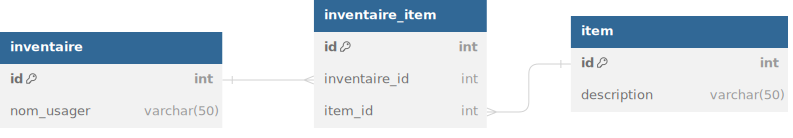

# Types de relations

Il existe trois types possibles de relation entre les tables :

## Un à plusieurs (1-n)

Prenons par exemple un jeu d'aventure qui comprend les tables usagers et personnages (dans ce jeu un usager peut se créer plus d'une partie simultanément). Un usager peut avoir plusieurs personnages, mais chaque personnage est propre à un usager.
Pour représenter cette relation dans la structure de la base de données, on va prendre la clé primaire de la table qui correspond au cas unique (ici l'usager) et on va l'ajouter à la table "plusieurs" (le personnage).

  

## Plusieurs à plusieurs (n-n)

Encore dans ce même jeu, on a une table inventaire et une table item. Le personnage peut avoir un inventaire qui contient plusieurs fois le même item, et chaque item peut être contenu dans plusieurs inventaires différents. On a donc une relation de plusieurs à plusieurs.
Au niveau de sa représentation, on va créer une troisième table "de jonction" qui va décomposer la relation de plusieurs à plusieurs en des relations un à plusieurs. Pour se faire, on va utiliser la même technique que pour la relation 1-n. Dans notre exemple il y aura une relation entre la clé primaire de la table inventaire et un champ "inventaire_id" de la table jonction. Même chose pour la table item et une relation avec la clé primaire et un champ "item_id" dans la table jonction.

  

## Un à un (1-1)

Dans cette relation, chaque entrée de la première table ne peut se retrouver qu'une seule fois dans la seconde et vice versa. Cette forme de relation n'est pas très courante, car habituellement les données des deux tables seraient stockées dans une seule. On pourrait par exemple l'utiliser pour stocker les informations plus sensibles de l'usager dans une autre table.

  